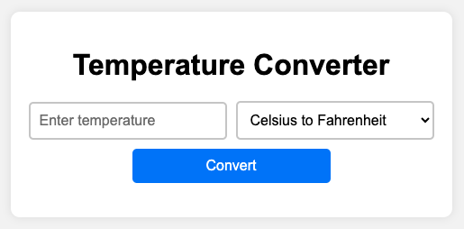
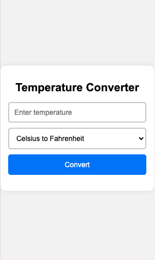

# 🌡️ Temperature Converter

A simple and responsive web-based temperature converter that allows users to convert between Celsius and Fahrenheit.

## 🚀 Live Demo
You can try the **Temperature Converter** live here:  
👉 [Temperature Converter](https://andy-carrillo.github.io/temperature-converter/)

## 🚀 Features
- Convert temperatures **from Celsius to Fahrenheit** and **vice versa**.
- **Input validation** with error messages for invalid values.
- **Responsive design** for mobile and desktop compatibility.
- **Live conversion on Enter key press**.
- **Smooth UI with transitions** for a better user experience.

## 📜 How to Use
1. Enter a temperature value in the input field.
2. Select the conversion type (Celsius to Fahrenheit or Fahrenheit to Celsius).
3. Click the **Convert** button (or press **Enter**).
4. The converted temperature will be displayed below.

## 🛠️ Technologies Used
- **HTML5** → Page structure
- **CSS3** → Styling and responsiveness
- **JavaScript (ES6)** → Functionality and logic
- **Live Server (VS Code Extension)** → Local development preview

## 🖼️ Screenshots
### Desktop View

### Mobile View

## 👨‍💻 Author & Credits
Developed by **Andres Carrillo**  
For educational purposes – *University of the People (UoPeople), Web Programming 1* 📚
